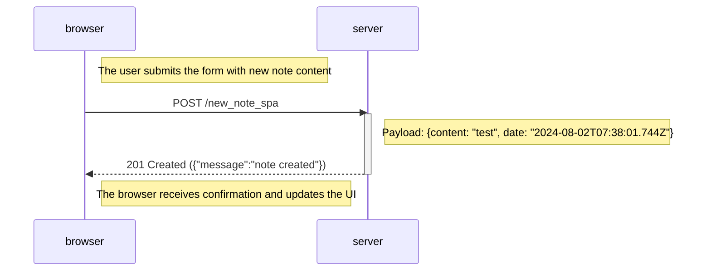

```mermaid
sequenceDiagram
    participant browser
    participant server

    Note right of browser: The user submits the form with new note content

    browser->>server: POST /new_note_spa
    activate server
    Note right of server: Payload: {content: "test", date: "2024-08-02T07:38:01.744Z"}

    server-->>browser: 201 Created ({"message":"note created"})
    deactivate server

    Note right of browser: The browser receives confirmation and updates the UI
```
